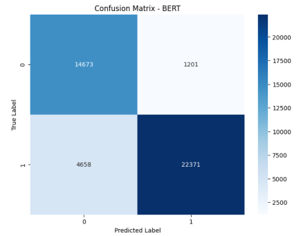
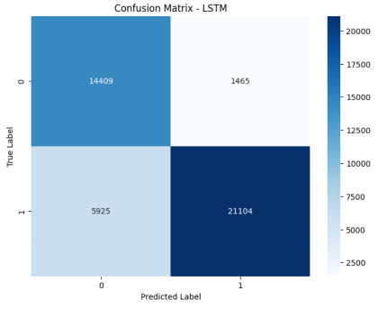

# Fake News Detection with Fine-Tuned BERT, DistilBERT, and ALBERT: Performance Comparison

## Overview

In an era where information spreads rapidly across digital platforms, distinguishing between real and fake news has become increasingly challenging yet critically important. Fake news can influence public opinion, misinform decision-making, and erode trust in media. This project explores the application of machine learning to detect fake news, focusing on short text snippets rather than full articles, making the task particularly challenging.

In this project, we fine-tuned several state-of-the-art language models, including BERT, DistilBERT, and ALBERT, alongside an LSTM model that serves as a baseline for comparison. By analyzing and comparing the results of these models, we aim to determine the most effective approach for detecting fake news.

## Models

### 1. Pre-trained Language Models (LLMs)
- **BERT (Base version)**: A transformer-based model widely used in various NLP tasks.
- **DistilBERT**: A smaller and faster variant of BERT, designed for resource efficiency.
- **ALBERT**: A version of BERT with parameter-reduction techniques, intended for faster training and deployment.

All LLMs were imported from Hugging Face and fine-tuned using LoRA (Low-Rank Adaptation), making it possible to adapt these pre-trained models to the fake news detection task efficiently.

### 2. LSTM (Long Short-Term Memory)
An LSTM model was implemented to create a baseline for comparison. Although not as powerful as the transformer-based models, LSTMs have traditionally been effective in sequence-based tasks.

## Dataset

Our dataset for training consists of 286K short text samples. These samples were gathered by merging six different datasets. The datasets used in this project are:

1. **LIAR dataset**
2. **FakeNewsNet**
3. **ISOT Fake News Dataset**
4. **WELFake_Dataset**
5. **Fake or Real News**
6. **newsdatasetwithcoviddata**

The merging of these datasets helped to create a diverse and robust training set, ensuring a wide coverage of fake and real news examples.

## Results

The models were evaluated based on four standard binary classification metrics: accuracy, precision, recall, and F1-score. 

| Metric            | BERT      | ALBERT    | DistilBERT | LSTM      |
|-------------------|-----------|-----------|------------|-----------|
| **Test Loss**     | 0.3566    | 0.3050    | 0.3695     | 0.4657    |
| **Test Accuracy** | 86.34%    | 84.84%    | 86.13%     | 82.78%    |
| **Test Precision**| 94.90%    | 95.20%    | 95.28%     | 85.13%    |
| **Test Recall**   | 82.77%    | 79.96%    | 82.05%     | 82.78%    |
| **Test F1**       | 88.42%    | 86.92%    | 88.17%     | 83.06%    |

### Confusion Matrices

To further analyze the model performance, confusion matrices for each model are provided below:

1 - real news , 0 - fake news

#### BERT


#### DistilBERT


#### ALBERT


#### LSTM


### How to Run

This project was originally developed and executed on a Kaggle notebook. Follow these steps to run the model on Kaggle:

1. **Set Up a Kaggle Notebook:**
   - Log in to your Kaggle account.
   - Navigate to the [Kaggle Notebooks](https://www.kaggle.com/notebooks) section.
   - Click on "New Notebook" to create a fresh notebook.

2. **Clone the Repository:**
   - In your Kaggle notebook, clone this repository by running the following command in a new code cell:
     ```bash
     !git clone https://github.com/DavidFrydman483/Fake_news_detector.git
     ```

3. **Navigate to the Project Directory:**
   - After cloning, navigate to the project directory:
     ```bash
     %cd Fake_news_detector
     ```

4. **Open and Run the Jupyter Notebook:**
   - Locate the `.ipynb` file within the repository and open it in your Kaggle notebook environment.
   - Run each cell sequentially to execute the model.

5. **Adjustments for Local Environment (Optional):**
   - If you plan to run this model in a different environment (e.g., local machine), you might need to adjust file paths, install required dependencies, or modify the environment settings.


## Conclusion

Our results demonstrate that the fine-tuned LLM models—**BERT**, **DistilBERT**, and **ALBERT**—outperform the **LSTM** model in terms of accuracy. BERT holds a slight advantage, though it comes with a larger model size, while DistilBERT delivers similar results in a more compact form. ALBERT, although efficient with fewer parameters, trails slightly in accuracy.

This comparison highlights the trade-off between model size and performance, where the LLM models achieve better accuracy but at the cost of significantly larger model sizes.


## References
- LIAR dataset - https://huggingface.co/datasets/ucsbnlp/liar/tree/main
- FakeNewsNet - https://www.kaggle.com/datasets/algord/fake-news
- ISOT Fake News Dataset - https://www.kaggle.com/datasets/emineyetm/fake-news-detection-datasets
- WELFake_Dataset - https://www.kaggle.com/datasets/saurabhshahane/fake-news-classification
- Fake or Real News - https://www.kaggle.com/datasets/jillanisofttech/fake-or-real-news
- newsdatasetwithcoviddata - https://github.com/prathameshmahankal/Fake-News-Detection-Using-BERT
- BertForSequenceClassification - https://huggingface.co/transformers/v3.0.2/model_doc/bert.html#bertforsequenceclassification
- AlbertForSequenceClassification - https://huggingface.co/transformers/v3.0.2/model_doc/albert.html#albertforsequenceclassification
- DistilBertForSequenceClassification - https://huggingface.co/docs/transformers/v4.44.0/en/model_doc/distilbert#transformers.DistilBertForSequenceClassification
- Inspired by prathameshmahankal - Fake-News-Detection-Using-BERT - https://github.com/prathameshmahankal/Fake-News-Detection-Using-BERT

